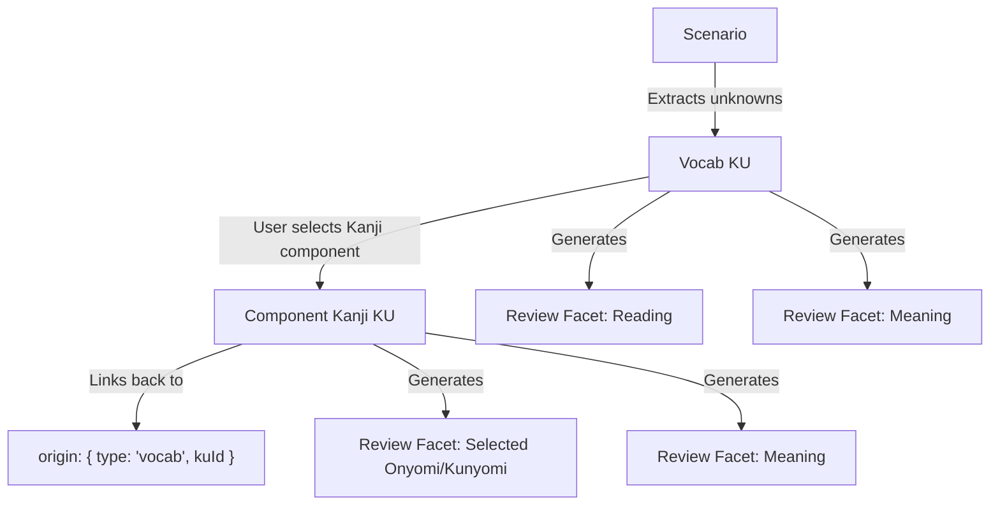

# AISRS-Japanese Domain Model

This document outlines the core domain concepts in the AISRS application, ensuring consistency for both developers and AI agents working on the project.

## Core Terminology

### 1. Knowledge Unit (KU)
A discrete item, word, or concept the user wants to learn. 
- **Types**: 
  - `Vocab`: A word or compound.
  - `Kanji`: A specific Kanji character's meaning and reading.
  - `Grammar`: Conceptual framework (e.g., nominalizers, verb conjugations).
  - `Concept`: Cultural or usage concepts.
  - `Example Sentence`: Sentences generated for context.
- **Status Lifecycle**:
  - `learning`: newly instantiated, pending initial lesson generation and facet selection.
  - `reviewing`: user has "learned" the unit and selected specific review facets to be tested on.

### 2. Review Facet
A specific angle or property of a KU that the user wants to be tested on during their SRS (Spaced Repetition System) reviews.
- Generated from KUs based on user selection in the "Learn" tab.
- Contains scheduling metadata: `nextReviewAt`, `interval`, `ease`.
- **Examples**:
  - Content-to-Reading (show term, type reading)
  - Definition-to-Content (show definition, type term)
  - Content-to-Definition (show term, type definition)
  - Kanji-Component-Meaning / Kanji-Component-Reading
  - AI-Generated-Question (the question, expected answer, and review are handled by Gemini)

### 3. Queues
The system separates pending work into distinct queues:
- **Learning Queue**: KUs that exist in the system but have never been processed into a lesson yet. Handled on the "Learn" screen.
- **Review Queue**: Review Facets where `nextReviewAt` is past due. Handled on the "Review" screen.

### 4. Scenarios
A more advanced system module distinct from simple flashcards. Scenarios facilitate multi-turn, AI-driven roleplay simulations.
- **Encounter Mode**: The user roleplays in Japanese. Gemini evaluates the conversation and extracts potential new phrases/words as "Learnings" (connecting them back to KU generation).
- **Drill / Simulation**: The user attempts an objective. The system monitors progress (e.g., `sceneFinished: true` or `isObjectiveMet: true`).

## Key Relationships

## Firestore Specifics
- All Dates (`nextReviewAt`, `createdAt`, `lastReviewAt`) **must** be stored natively as Firestore `Timestamp` objects. They must never be saved as ISO strings, as it breaks range query compatibility `where('nextReviewAt', '<=', now)`.
- Component Kanji KU's are not automatically bound to facets when a user selects a Kanji to learn from a parent vocab lesson. The creation of the Kanji KU places it back into the Learning Queue for the user to explicitly handle in a separate step.
